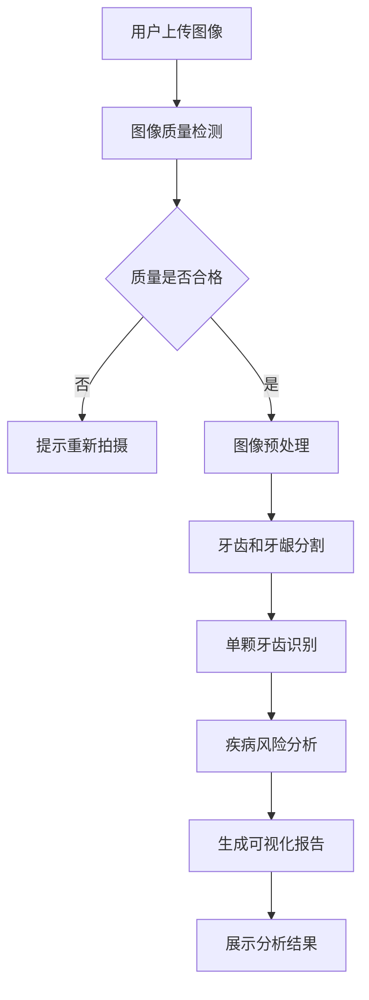

# 牙齿图像分析软件产品需求文档

## 1. 产品概述

牙齿图像分析软件是一款基于人工智能技术的专业口腔健康分析工具，通过用户上传的牙齿照片，自动进行牙齿和牙龈的识别、分割和健康评估，为用户提供个性化的口腔健康报告和预防建议。

**目标用户**：普通消费者、牙科诊所、口腔健康管理机构
**核心价值**：提供便捷、准确的口腔健康自检工具，帮助用户及早发现口腔问题，降低牙科治疗成本

## 2. 核心功能

### 2.1 用户角色

| 角色 | 注册方式 | 核心权限 |
|------|----------|----------|
| 普通用户 | 手机号/邮箱注册 | 上传照片、查看分析报告、历史记录 |
| 高级用户 | 付费升级 | 高级分析功能、专业报告、医生咨询 |
| 医生用户 | 资质认证 | 查看患者报告、标注修正、治疗建议 |

### 2.2 功能模块

本软件包含以下核心功能页面：

1. **首页**：功能介绍、上传入口、使用指南
2. **图像上传页面**：照片拍摄指导、图像上传、质量检测
3. **分析结果页面**：可视化报告、健康评分、问题标注
4. **历史记录页面**：历史分析报告、对比功能、趋势追踪
5. **个人中心页面**：用户信息、设置、帮助中心

### 2.3 页面详细功能

| 页面名称 | 模块名称 | 功能描述 |
|----------|----------|----------|
| 首页 | 产品展示模块 | 展示产品核心功能、使用流程、优势特点 |
| 首页 | 快速开始模块 | 提供明显的上传入口按钮，引导用户开始使用 |
| 图像上传页面 | 拍摄指导模块 | 提供牙齿拍摄的最佳角度、光线、姿势指导 |
| 图像上传页面 | 图像上传模块 | 支持从相册选择或直接拍摄，实时质量检测 |
| 图像上传页面 | 预处理模块 | 自动进行图像裁剪、增强、去噪等预处理 |
| 分析结果页面 | 可视化展示模块 | 显示原始图像和分析后的标记图像对比 |
| 分析结果页面 | 健康评分模块 | 综合评分、各区域详细评分、风险等级 |
| 分析结果页面 | 问题标注模块 | 在图像上标注问题区域，提供详细说明 |
| 分析结果页面 | 建议模块 | 基于分析结果提供个性化护理建议 |
| 历史记录页面 | 报告列表模块 | 按时间顺序展示所有历史分析报告 |
| 历史记录页面 | 对比分析模块 | 支持不同时间点的报告对比，显示变化趋势 |
| 个人中心页面 | 用户信息模块 | 显示和编辑个人基本信息 |
| 个人中心页面 | 设置模块 | 通知设置、隐私设置、账号管理 |

## 3. 核心流程

### 3.1 用户操作流程

1. **首次使用流程**：
   - 进入首页 → 了解产品功能 → 注册/登录 → 进入上传页面
   - 查看拍摄指导 → 上传牙齿照片 → 等待分析完成 → 查看结果
   - 保存报告 → 查看护理建议 → 设置提醒 → 退出

2. **回访用户流程**：
   - 登录 → 选择上传新照片或查看历史记录
   - 上传新照片 → 快速分析 → 对比历史结果
   - 跟踪改善情况 → 获取新建议

### 3.2 图像分析流程

## 4. 用户界面设计

### 4.1 设计风格

- **主色调**：医疗蓝 (#2E86AB) + 健康绿 (#A23B72) + 纯净白 (#FFFFFF)
- **按钮样式**：圆角矩形，悬停效果，主要操作为实心按钮
- **字体**：中文使用思源黑体，英文使用Roboto，正文字号14-16px
- **布局风格**：卡片式布局，清晰的信息层级，充足的留白
- **图标风格**：线性图标，简洁明了，符合医疗软件的专业感

### 4.2 页面设计详情

| 页面名称 | 模块名称 | UI元素 |
|----------|----------|--------|
| 首页 | 产品展示 | 全屏背景图，渐变遮罩，突出的价值主张文字 |
| 图像上传页面 | 拍摄指导 | 步骤卡片式布局，配图说明，进度指示器 |
| 分析结果页面 | 可视化展示 | 左右对比图，滑块对比，颜色编码的风险标记 |
| 历史记录页面 | 报告列表 | 时间轴设计，缩略图预览，关键指标摘要 |

### 4.3 响应式设计

- **桌面端优先**：主要面向平板和桌面设备使用
- **移动端适配**：支持手机端基本功能，简化操作流程
- **触控优化**：按钮大小适合触控操作，支持手势操作

## 5. 性能要求

### 5.1 分析性能
- 图像上传时间：≤ 5秒（单张2MB图像）
- 分析处理时间：≤ 30秒（完整分析）
- 并发处理能力：支持1000用户同时在线
- 系统响应时间：页面加载≤3秒，操作响应≤1秒

### 5.2 准确性要求
- 牙齿分割准确率：≥ 95%
- 单颗牙齿识别准确率：≥ 90%
- 疾病检测敏感度：≥ 85%
- 假阳性率：≤ 10%

### 5.3 图像要求
- 支持格式：JPG、PNG、HEIC
- 最大文件大小：10MB
- 最小分辨率：1080x720px
- 推荐分辨率：2048x1536px

## 6. 数据安全和隐私

### 6.1 数据保护
- 所有用户数据采用端到端加密传输
- 医疗图像数据使用AES-256加密存储
- 实施数据脱敏处理，保护用户身份隐私
- 定期数据备份和灾难恢复机制

### 6.2 隐私合规
- 符合GDPR和《个人信息保护法》要求
- 明确的数据收集和使用政策
- 用户数据删除权利保障
- 第三方数据共享需用户明确授权

### 6.3 访问控制
- 基于角色的访问控制（RBAC）
- 多因素身份认证
- 会话管理和超时控制
- 审计日志记录所有数据访问

## 7. 技术挑战

### 7.1 图像处理挑战
- **光照条件不一致**：需要鲁棒的预处理算法适应不同光照
- **角度和姿态变化**：开发多角度图像融合和校正技术
- **口腔环境复杂**：处理唾液反光、牙齿不齐等复杂情况
- **图像质量参差不齐**：智能质量评估和增强算法

### 7.2 人工智能挑战
- **小样本学习**：医疗数据稀缺，需要迁移学习和数据增强
- **多任务学习**：同时进行分割、分类、检测等多个任务
- **可解释性**：提供AI决策的可解释性，增强用户信任
- **模型轻量化**：在保持准确性的同时减少计算资源需求

### 7.3 产品化挑战
- **实时性要求**：平衡分析精度和处理速度
- **用户体验优化**：简化专业复杂的医疗分析流程
- **医疗合规性**：符合医疗器械软件相关法规要求
- **跨平台兼容**：支持多种设备和操作系统

## 8. 扩展功能

### 8.1 未来版本规划
- **3D牙齿建模**：基于多张照片重建3D牙齿模型
- **治疗模拟**：模拟不同治疗方案的效果
- **智能提醒**：基于分析结果推送个性化护理提醒
- **医生对接**：连接在线牙科咨询服务

### 8.2 数据价值挖掘
- **群体健康分析**：匿名化数据分析口腔健康趋势
- **预防医学研究**：为口腔疾病预防提供数据支持
- **个性化产品推荐**：基于口腔状况推荐护理产品
- **保险风险评估**：为牙科保险提供风险定价依据